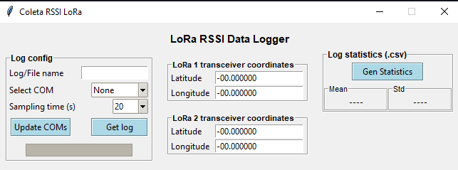
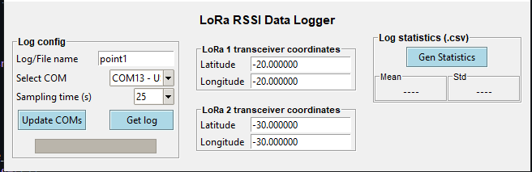
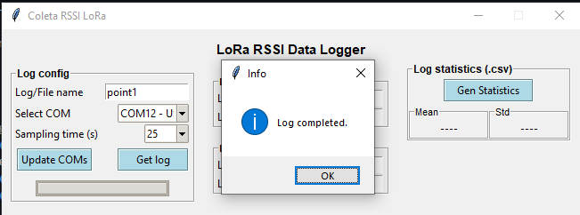
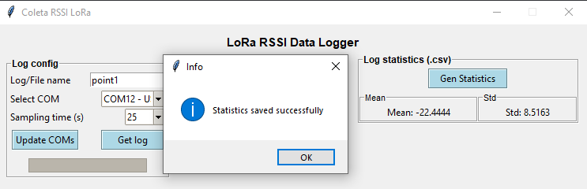
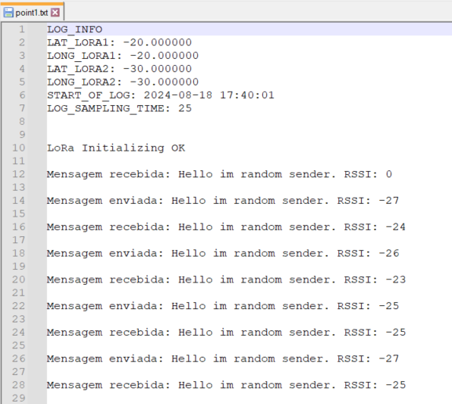
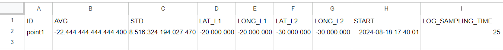

# LoRa RSSI Data Logger

Data Logger simples para coleta de RSSI entre transceptores LoRa e aquisição de estatísticas automaticamente via programa/executável Python. Ideal para testes de alcance do LoRa em visitas técnicas.

## Sobre o projeto

O programa realiza a coleta de dados de RSSI (intensidade de sinal) entre dois transceptores LoRa, registrando os logs/debugs em um arquivo de texto (.txt) e gerando um arquivo .csv com informações como a **Média**, o **Desvio Padrão Amostral** e os **dados de localização** (coordenadas) correspondentes. A coleta é feita por meio do monitoramento da porta COM à qual o microcontrolador (ESP32/Arduino) está conectado.

## Como usar / Instalação

1. Compile o código (``getRssiLoRa.ino``) nas placas ESP32/Arduino
2. Abra o executável `LoRaRssiDataLogger`

    

#####

3.  Digite o nome do arquivo (log) em que serão salvas as mensagens da comunicação serial em **Log/File name**
4. Em **Select COM**, selecione a Porta Serial (COM) a qual o microcontrolador está se comunicando com o computador. Caso a porta não apareça na lista de início, aperte o botão **Update COMs** para solucionar o problema
5. Selecione o tempo de coleta de dados RSSI em **Sampling time**
6. Informe as coordenadas de cada transceptor LoRa / microcontrolador nas seções **LoRa 1/2 transceiver coordinates**. Por padrão, o programa grava "00.000000"

    

###

7. Tendo feito os passos ``1-6``, aperte o botão **Get log** para iniciar a coleta de dados de RSSI. Note que a barra de progresso da seção *Log config* se preenche ao longo do tempo

    
###
8. Ao finalizar a gravação do log, clique no botão **Gen Statistics** para gerar as estatísticas baseadas no arquivo nomeado em *Log/File name*. 

    

####

Ao finalizar os passos ``1-8``, dois arquivos foram criados no diretório do programa: **point1.txt** e **stats.csv**

O arquivo **point1** é o log coletado. Ele contém as informações/configurações da coleta e as mensagens trocadas entre computador-microcontrolador via Serial.

####
**stats** é o arquivo .csv que contém as estatísticas/informações de todos os log's coletados, e estão organizados em formato de tabela para facilitar a manipulação de dados.

## Código (.ino)

O código ``.ino`` desenvolvido implementa uma comunicação do tipo "ping-pong", em que ambos os transceptores LoRa atuam simultaneamente como transmissores e receptores de uma mensagem (payload) fixa. Para evitar colisões ou coincidências, como ambos os dispositivos tentarem transmitir ou receber ao mesmo tempo, são utilizados atrasos aleatórios e reinicializações automáticas.

É possível modificar o tempo que cada transceptor realiza a transmissão dos pacotes e o tempo limite para receber um pacote modificando as variáveis:

~~~cpp
const int SENDING_TIME = 5020;   // milisegundos
const int RX_TIMEOUT = 11000;    // milisegundos
~~~

É possível modificar os parâmetros do rádio LoRa modificando a função `LoRa_radio_config`:

~~~cpp
void LoRa_radio_config() {
    LoRa.setGain(0);
    LoRa.setPreambleLength(8);
    LoRa.setCodingRate4(5);
    LoRa.setSpreadingFactor(7);
    LoRa.setSyncWord(0xF3);
}
~~~~

## Inspirado em
- [``FBSeletronica``](https://gist.github.com/FBSeletronica/029491e3c197b185ea8a65ac4f412335)
- [``arduino-LoRa (LoRaDuplex example)``](https://github.com/sandeepmistry/arduino-LoRa/blob/master/examples/LoRaDuplex/LoRaDuplex.ino)